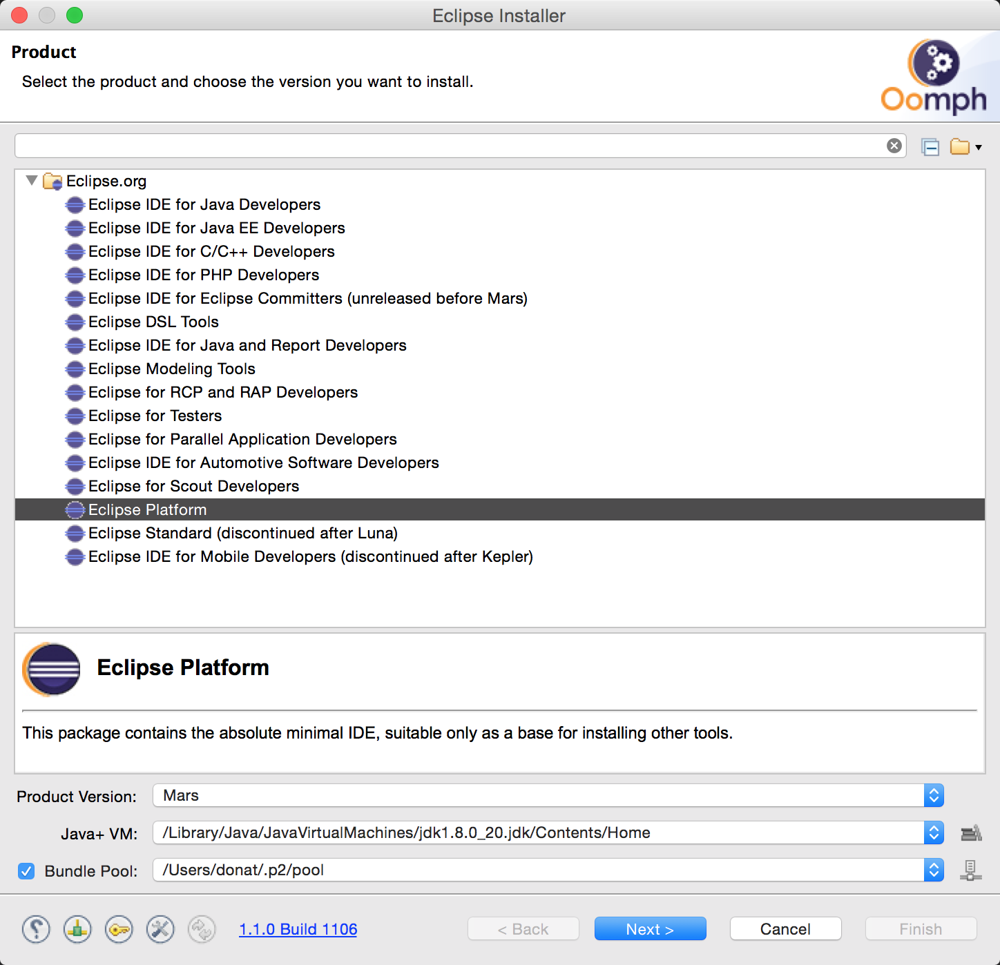
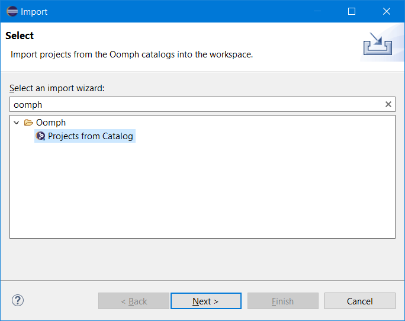
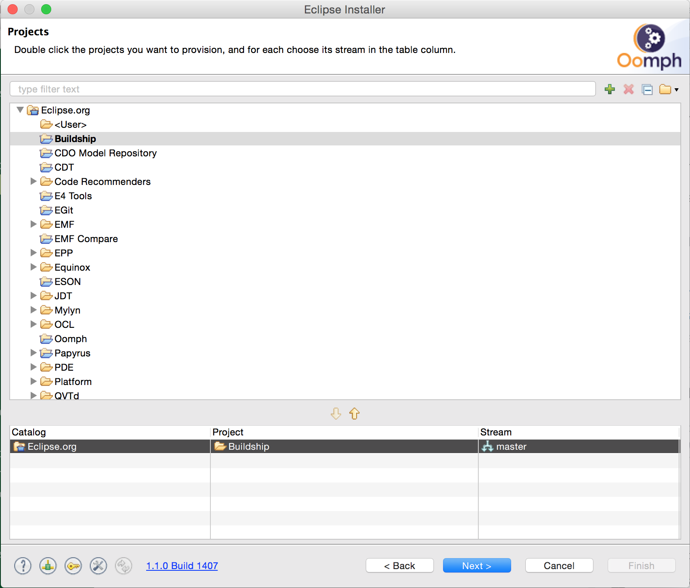
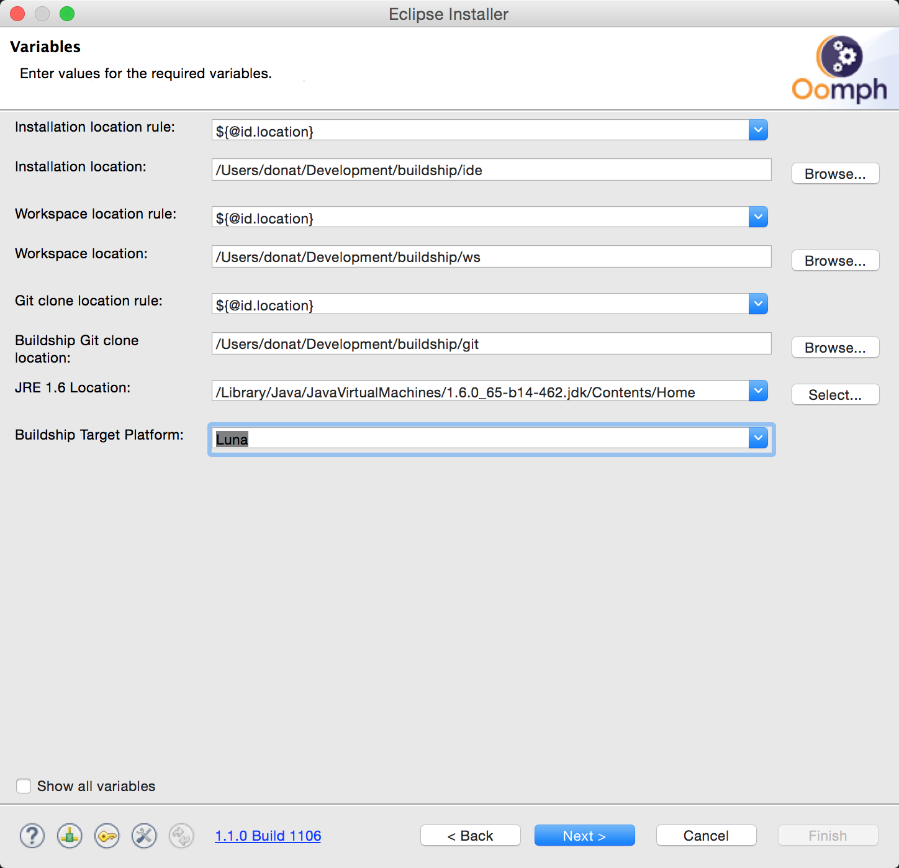
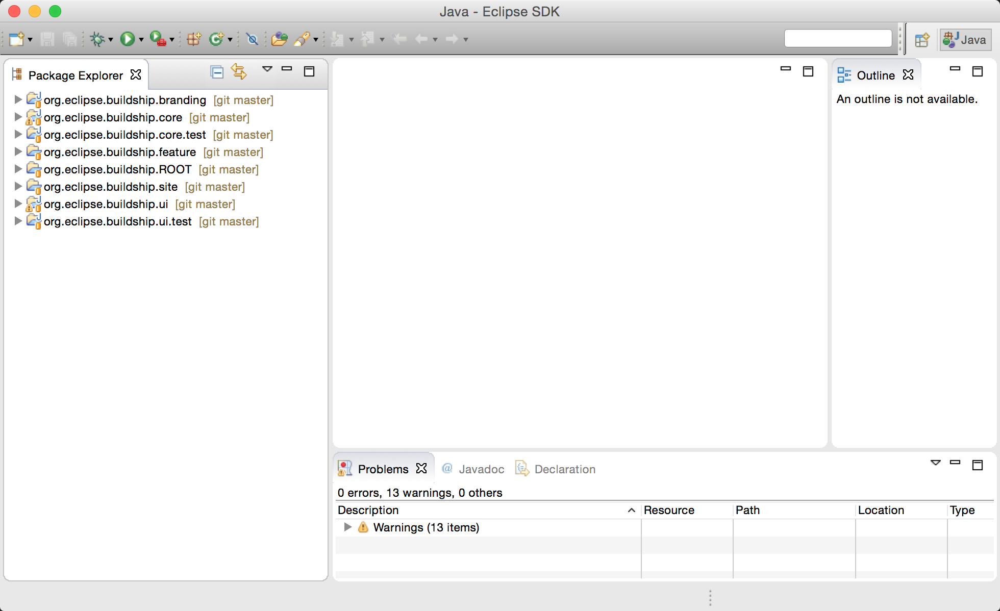
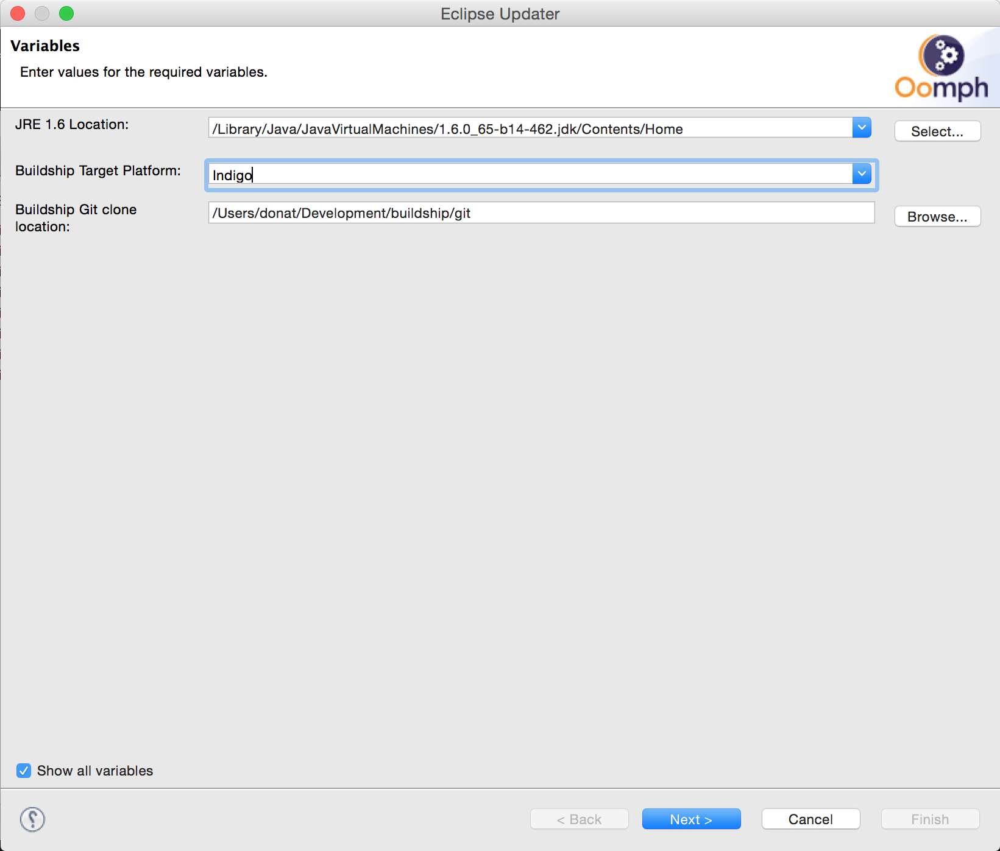

# Development Setup Instructions

We use Eclipse

 * as our development environment of Buildship and
 * as our target platform against which we compile and run Buildship.

This page describes the steps to set up Eclipse such that it can be used for development of Buildship.

## Oomph-based setup

In order to provide an easy-to-setup and consistent working environment for development, we use [Oomph](https://projects.eclipse.org/projects/tools.oomph), the
new default Eclipse installer. Oomph is a model-based tool to install custom Eclipse distributions. The model instructs Oomph to set up the environment such that

 * the JDK is aligned to the project
 * the target platform is set
 * the Buildship git repository is cloned and imported into the workspace
 * the code formatter settings are customized

### 1. Install Oomph

The latest version of Oomph is available at the [project's wiki page](https://wiki.eclipse.org/Eclipse_Oomph_Installer). Download and extract the binary that matches
your environment. When you start Oomph, click the Advanced Mode icon. 

You should then see the screen below. Select _Eclipse IDE for Eclipse committers_. Check if the _VM_ and the _Bundle pool_ have proper values. Then click _Next_.

If you already have an Eclipse for Committers instance that you want to use, you can import the project instead. Use Import Project:

### 2. Configure the Buildship model

The Buildship setup model is available in the Oomph project catalog under the GitHub projects, just select it and hit next.

### 3. Specify installation properties

On the properties screen you have to specify the environment-specific variables:

 * the location of the custom Eclipse distribution
 * the location of workspace and the git clone
 * the JRE locations

 > **_NOTE:_**  Make sure the JREs are exactly the ones that are required

When done, the configuration should like the screen below. Click _Next_ and _Finish_ to start the installation.

Note that if you to run the installer multiple times, Oomph might remember some of the preferences. To make all variables visible, enable the _Show all variables_ checkbox.

### 4. Start the IDE

Once the installer finishes, the IDE will start up automatically. There are a few setup tasks running on startup (importing projects, setting up preferences). Wait for these to
finish before doing anything! Once finished, you should see the workspace below.

#### Text file encoding

If your are using Windows, make sure the text file encoding is set to `UTF-8`. This can be done under Windows > Preferences > General > Workspace > Text file encoding. Otherwise you might encounter `Unexpected character` errors.

#### Change the target platform

The target platform selected during the installation can be changed. To do that, open one of the `target-platforms/4XX.target` files and select `Set as Active Target Platform`

## Manual setup (deprecated)

### Getting the source code

The project and its source code is hosted on GitHub: `https://github.com/eclipse/buildship`.

Apply the following command to get a clone of the source code:

    git clone git@github.com:eclipse/buildship.git

#### Committers

Navigate into the created _buildship_ directory and set the git username and email address:

    git config user.name "johnsmith"
    git config user.email "john.smith@gradleware.com"

And make sure to properly map the part before the domain of your email address in TeamCity under _My Settings & Tools_ >>
_General_ >> _Version Control Username Settings_ >> _Default for all of the Git roots_.

    john.smith

From now on, when you commit to the _buildship_ project through Git, the change will be properly associated with your user in
TeamCity. You can verify that the setup is correct by seeing your full name next to each commit.

In order to avoid extra commits in the Git history after merging local changes with remote changes, apply the
_rebase_ strategy when pulling in the remote changes. By applying the _update_ alias listed below, you can conveniently
pull in the remote changes from master without ending up with ‘merge branch’ commits in the Git history later on.

    git config --global alias.update=“pull --rebase origin master”
    git update

### Importing the source code into Eclipse

The source code consists of a single root project and several sub-projects nested within it. You can use the
generic Eclipse 'Import Existing Projects' wizard. Select the root folder _buildship_ and
check the option 'Search for nested projects'. Select all _com.gradleware.*_ projects. You
can then press _Finish_.

### Setting the target platform

After importing all the projects into Eclipse, there will be some build errors due to code references to missing
plugins. To add these missing plugins to Eclipse, open the _target-platforms/423.target_ file (or the one matching your
desired target platform version) located in the project root folder and click _Set as Target Platform_
in the top-right corner. This will fix all compilation issues. Note that this might take a while since the entire
SDK for the specified Eclipse version will be downloaded.

## Running the tests in Eclipse

To run the complete set of core tests from inside Eclipse, right-click
on the _org.eclipse.buildship.core.test_ package and choose _Run As >> JUnit Plug-In-Test_.
Individual tests can be run the same way.

To run the complete set of ui tests from inside Eclipse, right-click
on the _org.eclipse.buildship.ui.test_ package and choose _Run As >> Run Configurations..._. In the
shown dialog, create a new _JUnit Plug-In-Test_ run configuration. Select the _Test_ tab and ensure
that the _Run in UI thread_ checkbox is unchecked, then click _Run_ (Buildship uses SWTBot tests, which
must be run in a non-UI thread). When running the UI tests in the future, click on the
_org.eclipse.buildship.ui.test_ package and choose _Run As >> JUnit Plug-In-Test_ since
the run configurations are saved. Individual tests can be run the same way.

## Enabling Tracing

Tracing can be enabled in the _Tracing_ tab of the _Run Configurations..._ dialog.

## Running the Build

To run the full build, execute

    ./gradlew build

The final P2 repository will be created in the `org.eclipse.buildship.site/build/repository` directory. If
the target platform had not been downloaded previously, it will appear in the _~/.tooling/eclipse/targetPlatforms_ folder.

To run the build without running the tests, exclude the `eclipseTest` task:

    ./gradlew build -x eclipseTest

To have full build ids in the name of the generated jars and in the manifest files, set the `build.invoker` property to _ci_:

    ./gradlew build -Pbuild.invoker=ci

The available target platforms are defined in the root project's _build.gradle_ file, under the _eclipseBuild_ node.
By default, the build runs against target platform version _45_. To build against a different target platform version,
you can set the `eclipse.version` Gradle project property:

    ./gradlew build -Peclipse.version=44

## Continuous Integration

Buildship is continuously built on our [Continuous Integration Server](https://builds.gradle.org/project.html?projectId=Tooling_Buildship&tab=projectOverview).

## Issue tracking

All issues related to Buildship are recorded in [Bugzilla](https://bugs.eclipse.org/bugs/buglist.cgi?bug_status=UNCONFIRMED&bug_status=NEW&bug_status=ASSIGNED&bug_status=REOPENED&bug_status=RESOLVED&bug_status=VERIFIED&bug_status=CLOSED&list_id=12071590&product=Buildship&query_format=advanced&resolution=---&resolution=FIXED&resolution=INVALID&resolution=WONTFIX&resolution=DUPLICATE&resolution=WORKSFORME&resolution=MOVED&resolution=NOT_ECLIPSE).

### Workflow

The following workflow is applied to all Buildship issues tracked in Bugzilla:

1. The reporter creates the issue.
1. Once the issue is understood by the committers and the issue is about to be fixed, the state is set to **assigned**.
1. After the issue is fixed and a snapshot version with the fix is released, the state is changed to **resolved**.
1. The committer waits for a few days for the reporter to set the state to **verified**.
1. Once verification is received or no feedback is received, the committer sets the state to **closed**.

## References

* [Eclipse Testing](http://wiki.eclipse.org/Eclipse/Testing)
* [PDE Test Automation](http://www.eclipse.org/articles/article.php?file=Article-PDEJUnitAntAutomation/index.html)
* [Enabling Tracing](http://help.eclipse.org/luna/index.jsp?topic=%2Forg.eclipse.pde.doc.user%2Fguide%2Ftools%2Flaunchers%2Ftracing.htm)
* [SWTBot Testing](https://wiki.eclipse.org/SWTBot/UsersGuide)
